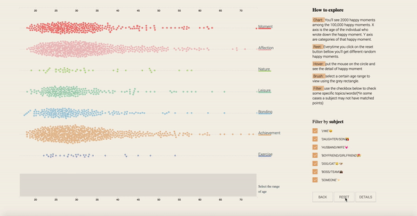

## Happy 100,000 times :)
### By Daisy Chen
Critical data & visualization | NYUSH | IMA | Spring 2020

What’s the data of happiness? And how would you describe happiness? 

Instead of showing numbers that quantify the level of happiness of analysis about the reasons for happiness, this data visualization takes a more emotional path. Here the audience will be about to immerse in the exploration of 100,000 happy moments written down by different individuals. Features like filters and brushes enable the viewers to look closer to the moments and encounter surprises. Details about the dataset are also provided in the “details” page. (By clicking the details button the viewer can navigate to it.)

Please enjoy:)

Dataset: [HappyDB](https://github.com/megagonlabs/HappyDB)
